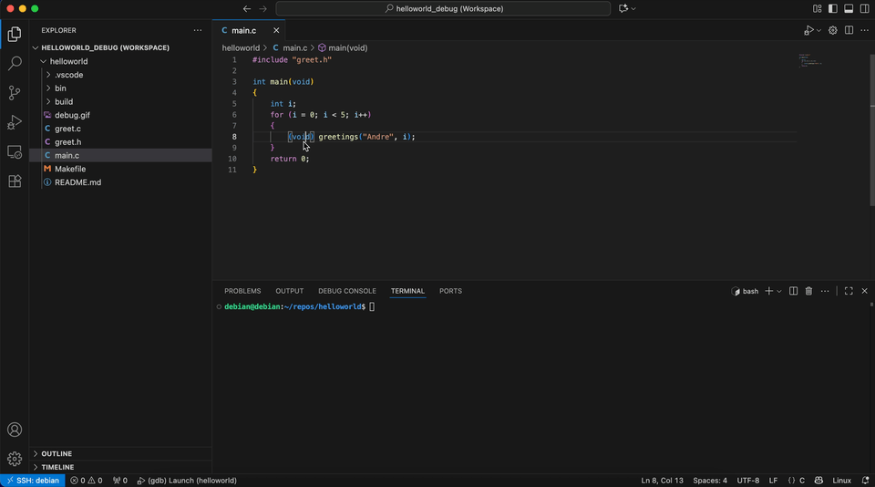

# Hello World - Cross-Debug Reference App

This is a simple `Hello World` application which contains a **VS Code Workspace** configured for **Embedded Cross-Debugging** using VS Code as a GDB front-end.



## VSCode Dependencies
Install [Native Debug](https://marketplace.visualstudio.com/items?itemName=webfreak.debug) extension.

Recommended: install [C/C++](https://marketplace.visualstudio.com/items?itemName=ms-vscode.cpptools) extension.

## Build
```bash
# Source cross-compilation SDK (E.g.)
$ source /opt/pokytos/1.0.0/environ...

# Use Debug compiler configurations
$ make BUILD=debug
```

## VSCode Workspace Setup customizations
.vscode/launch.json
```text
miDebuggerPath: Set path to cross-platform debugger
miDebuggerServerAddress: Customize with your target ip address
program: Program with debugging symbols to read from (set to current app)
```

.vscode/tasks.json
```text
command: Customize with your target ip address
```

</br>

# Start Debug Session
**Run and Debug** > Select `(gdb Launch)` > **Start Debugging**

This **Launch** session will automatically execute in order the following tasks:
```text
1. copy-binary-to-target
Copies compiled application to target's home folder

2. start-gdbserver
Starts gdbserver waiting on port 2001 to debug helloworld application

3. Launch and attach - application halts in main() waiting for user input
```

**You can now remotely debug this example application**

When terminating this session, the following tasks are automatically executed:
```text
1. stop-server
Stops all gdbserver processes in target

2. clean-debug-session
Removes copied binary from home directory
```
